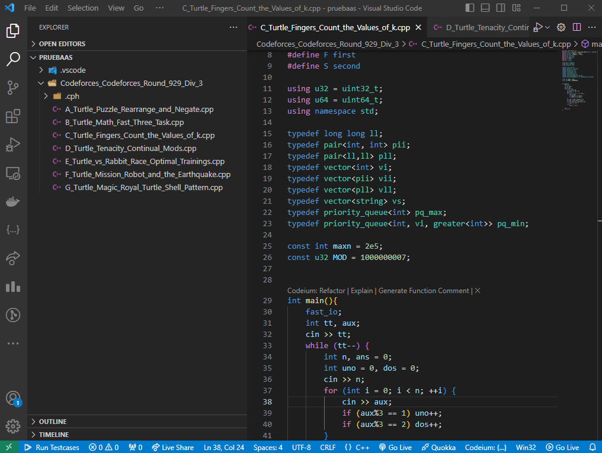
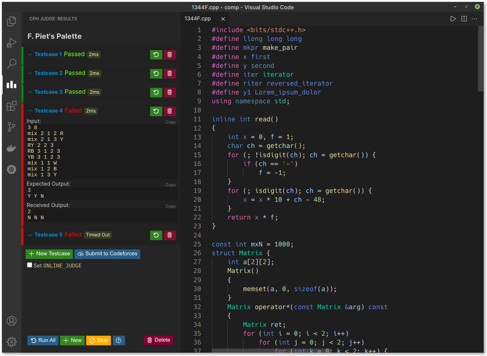

# Customizacion of Competitive Programming Helper (cph)

## New feature added
-   Organization of the problems in folders with the name of the source contest 

Quickly compile, run and judge competitive programming problems in VS Code.
Automatically download testcases , or write & test your own problems. Once you
are done, easily your solutions directly with the click of a button!

Cph supports a large number of popular platforms like Codeforces, Codechef,
TopCoder etc. with the help of competitive companion browser extension

## Quick start

1. [Install cph](https://marketplace.visualstudio.com/items?itemName=DivyanshuAgrawal.competitive-programming-helper)
   in VS Code and open any folder.
1. [Install competitive companion](https://github.com/jmerle/competitive-companion#readme)
   in your browser.
1. Use Companion by pressing the green plus (+) circle from the browser toolbar
   when visiting any problem page.
1. The file opens in VS Code with testcases preloaded. Press
   <kbd>Ctrl</kbd>+<kbd>Alt</kbd>+<kbd>B</kbd> to run them.

-   (Optional) Install the [cph-submit](https://github.com/agrawal-d/cph-submit)
    browser extension to enable submitting directly on CodeForces.
-   (Optional) Install submit client and config file from the
    [Kattis help page](https://open.kattis.com/help/submit) after logging in.

You can also use this extension locally, just open any supported file and press
'Run Testcases' (or <kbd>Ctrl</kbd>+<kbd>Alt</kbd>+<kbd>B</kbd>) to manually
enter testcases.

## Features

-   Automatic compilation with display for compilation errors.
-   Intelligent judge with support for signals, timeouts and runtime errors.
-   Works with Competitive Companion.
-   [Codeforces auto-submit](https://github.com/agrawal-d/cph-submit)
    integration.
-   [Kattis auto-submit](docs/user-guide.md) integration.
-   Works locally for your own problems.
-   Support for several languages.

## Supported Languages

-   C++
-   C
-   Rust
-   Go
-   Haskell
-   Python
-   Java
-   JavaScript (Node.js)